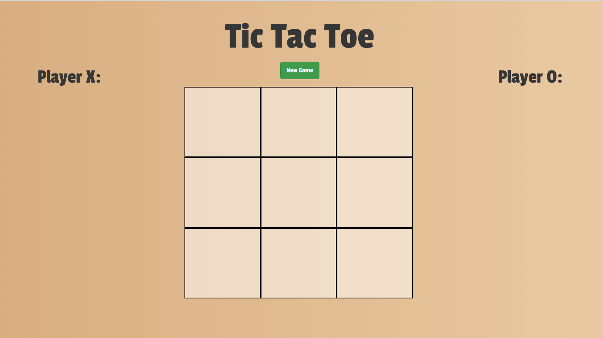
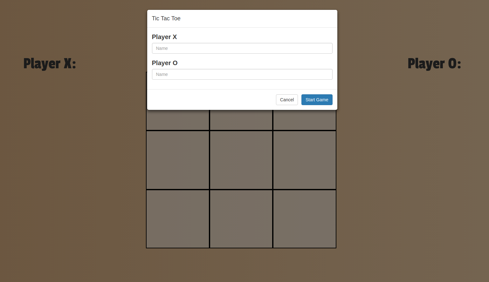

# tic-tac-toe

> A classic game recreated with Javascript! Originally wrote the logic using Pyhton. 

### Setup Instructions

> 1. Fork this repo
> 1. Clone your forked copy of this repo
>    - `git clone https://github.com/[Your Username]/tic-tac-toe.git`
> 1. Change directory into the newly cloned repo
>    - `cd tic-tac-toe`
> 1. Open a browser and check it out!

Click "New Game" to begin

Enter the names for player X and player O

Enjoy the game!

